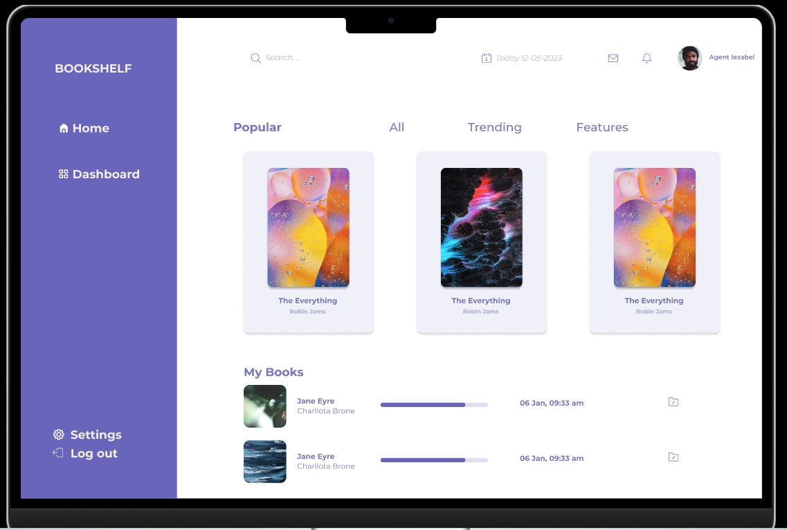

# bookshelf_API_DICODING_V2
# COMING SOON

# Library Dependencies
 - Express  (For Router Library)
 - MongoDB  (For restore Library)
 - Nanoid   (For Generator ID String)
 - Nodemon  (For otomatic restart Project)

# PROJECT TREE STRUCTURE
________
| HOMME |
├── README.md
├── doc.txt
├── package-lock.json
├── package.json
└── src
    ├── models
    │   └── book.js
    ├── routes
    │   └── books.js
    └── server
        └── server.js

# REQUIREMENT PROJECT
-- Requirement Project :
1. Kriteria 1 : Aplikasi menggunakan port 9000
2. Kriteria 2 : Aplikasi dijalankan dengan perintah npm run
   start.
3. Kriteria 3 : API dapat menyimpan buku
4. Kriteria 4 : API dapat menampilkan seluruh buku
5. Kriteria 5 : API dapat menampilkan detail buku (By ID)
6. Kriteria 6 : API dapat mengubah data buku
7. Kriteria 7 : API dapat menghapus buku

